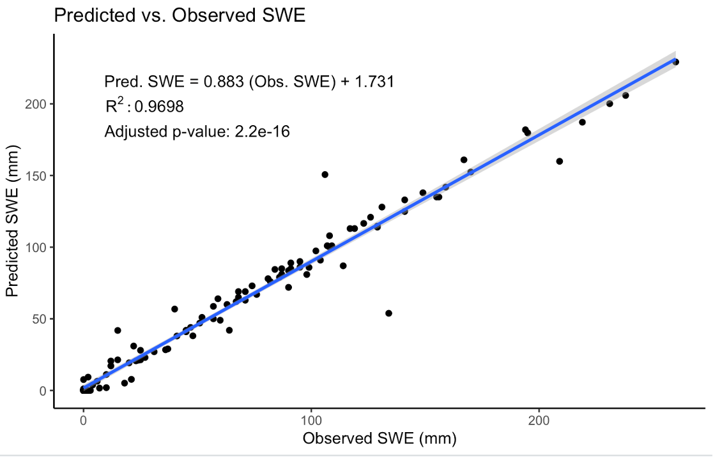

This project was focused on creating a landscape scale snow water equivalent (SWE) model in central Alaskan National Parks. This project, which was in collaboration with a NPS-based regional ecologist, used 30 year normal gridded temperature and precipitation data and site-specific SNOTEL data to predict SWE in a HUC 6 watershed in central Alaska. This model was developed primarily in Python and was based on a previous [model](https://onlinelibrary.wiley.com/doi/full/10.1002/hyp.8176) implemented by researchers at Oregon State University. This code created for this model also grabs data directly from the PRISM and SNOTEL websites and eliminates the need for large data downloads. Relatively accurate initial model output suggests that this model can likely be applied to other parts of Alaska as well. Check out the final model [here](https://github.com/samsamsam34/AKSnowModel)!

Here is a scatterplot showing SWE values predicted by the model vs. observed SWE values in this study area. 

[Return to Projects Page](projects.md){: .btn}
