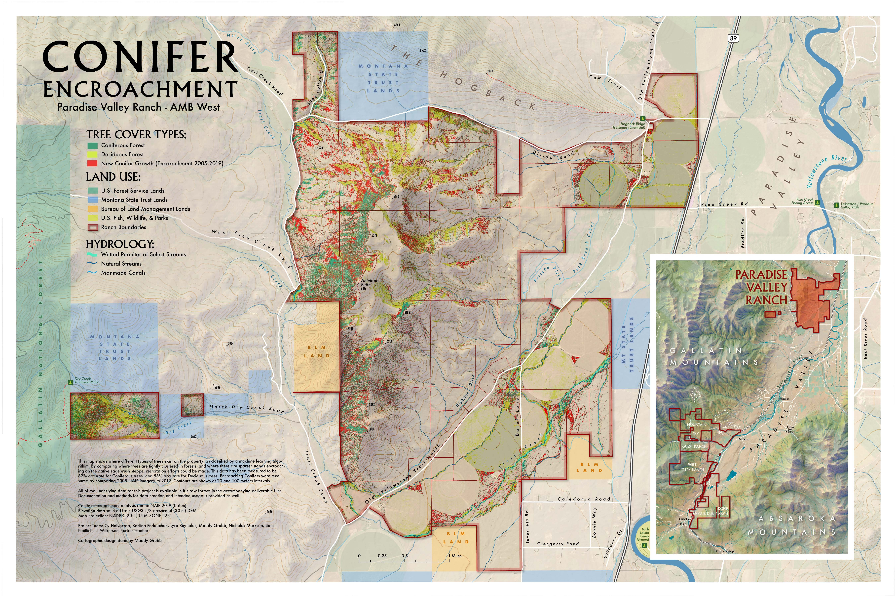
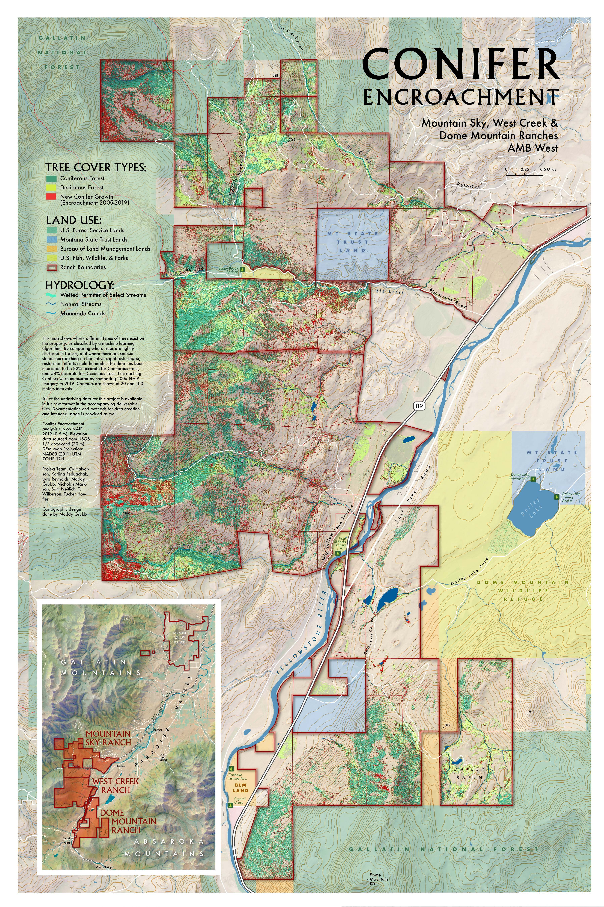
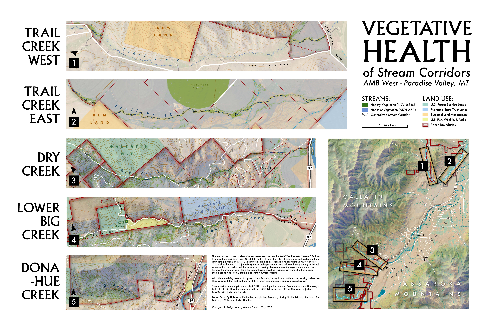

For my capstone geography course, I collaborated with a team of classmates to conduct a remote sensing-based project for the Arthur M. Blank land trust (AMB West). This land trust is roughly 32,000 acres and is located in the Paradise Valley in western Montana. In this project, our group worked with a senior program officer from AMB West to map the encroachment of conifers into deciduous forest and shrub steppe over time, digitize streams and track channel movement through time, and analyze overall riparian health. These individual sections were ultimately combined and used to identify the best places for restoration within the land trust. During this project, I assisted in the riparian monitoring effort by developing and implementing a workflow to measure the wetted perimeter surrounding stream corridors based on a normalized difference in vegetation index (NDVI) at a 1 meter scale. I also created metadata and documentation, and refined a previously used R script to produce a high resolution random forest-based landcover classification and accuracy assessment (although this was not used in the final product). Our final products and workflows were ultimately given to AMB West and will be used in future management decisions. 

The static maps created for this project are attached below. Note that these are georeferenced PDFs and can be rendered locationally on a map. 

The first two maps show conifer encroachment onto deciduous forest and shrub steppe in the northern and southern sections of the land trust, respectively.

This map shows the digitized wetted perimeters around five major streams within the land trust. The map also displays vegetation health (based on NDVI) in each of these wetted perimetes. 

[Return to Projects Page](projects.md){: .btn}
