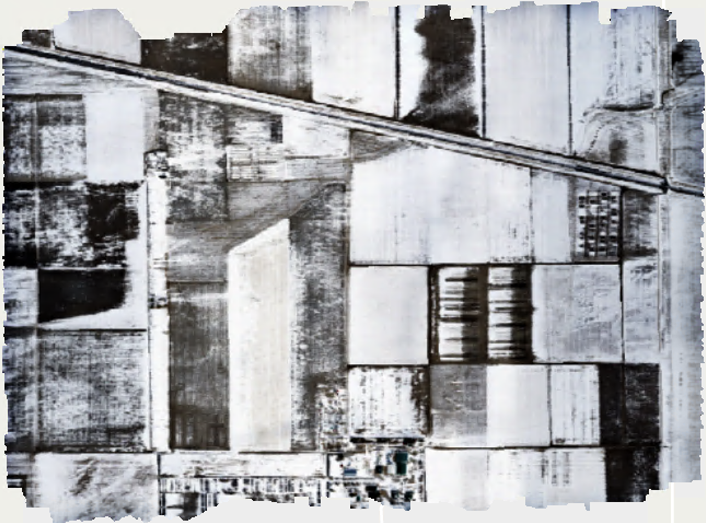

Over the past two years, I have worked as a member of the Montana State University geospatial snow, water, and ice resources lab ([GeoSWIRL](https://storymaps.arcgis.com/stories/baebbcc87c614173b216ee965ecbef67)). This lab group uses remote sensing, geospatial analysis, and Structure-from-Motion (SfM) to measure a variety of topics spanning the physical sciences and snow hydrology. As a member of this lab, I have participated in the following projects:

## Machine Learning Based Streamflow Model

This project is based on implementing a random forest machine learning model in order to predict the discharge of ungauged river basins on the basis of satellite-derived climate data across western Montana, Idaho and Washington. This analysis implements a cloud-based computing framework and is a continuation of the original Snow Cloud Hydro project linked [here](https://www.mdpi.com/2072-4292/10/8/1276/htm). In this project, I delineated watershed boundaries, prepared input data, ran Python code, and conducted statistical analysis and spatial exploration of output data. We are hoping to prepare a peer-reviewed journal article on this analysis in the upcoming future. 

## Campus Rooftop Snow Monitoring

This project relies on using high-resolution drone imagery to predict snow height and total snow load on MSU campus roofs. Drone imagery is processed using SfM and is validated with measurements from a weather station located on one of the roofs. During this project, I have operated drones, post-processed data in Agisoft Metashape, installed and used data collected from weather stations, and used survey-grade GPS to collect cm-level ground control points. Check out our interactive map [here](https://experience.arcgis.com/experience/fc37eab540c1495c886c8f460811b446). 

## 4D Snow Depth Processing

This project was based on using SfM to construct a 3D snow cover model and digital elevation model (DEM) for a MSU-owned research farm in central Montana. The original drone data was collected as part of NASA’s 2021 SnowEx campaign, and the model outputs will be used in combination with LiDAR data to validate UAVSAR measurements. In this project, I used Agisoft Metashape to construct a 4D model and produce orthomosaics, DEMs, and accuracy assessments for previously collected drone data. 

Below are an orthomosaic and DEM that were produced in this SfM model. These products were both constructed from images taken in January 2021.

